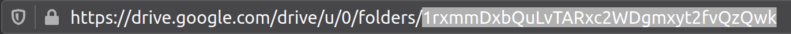

## Google Drive CLI

A command line interface to download/upload files to your google drive from the command line. Built with Python 3 (v3.6.9) on top of [PyDrive](https://github.com/googleworkspace/PyDrive) and the [Google Drive API](https://developers.google.com/drive/api/v3/about-sdk), as of March/2021.

### Setting up

Clone or donwload this repository and go to its folder from the terminal:

```
git clone https://github.com/tiagodc/GoogleDriveCLI.git
cd GoogleDriveCLI
```

Be sure to have python 3.x installed and install all dependencies (or setup a [virtualenv](docs/virtualenv.md)):

```
pip install -r requirements.txt
# or
conda install --file requirements.txt
```

Activate your google developer account and enable OAuth authentication. For a quick guide [click here](docs/oauth.md).

If it's your first time using the API and you don't have a credentials file, download the `client_secrets.json` file from your developer account (also in the [guide](docs/oauth.md). Then try to download/upload some files from/to your drive:

```
python gdrive.py --directory path/to/local/directory --parent #yourGoogleDriveFolderIdHash --auth path/to/client_secrets.json --credentials path/to/creentials.json [...]
```

Your google drive folder ID is the *hash* found at the end of the URL once you've browsed to the folder you want (highlighted):


A link will be shown on your terminal, just click on it to open the browser and follow the screen. On the first time you run the script the `--credentials` file will be created in the path you provide, otherwise it will create a `mycreds.json` file in the current directory. **Save this file somewhere safe** and use it from now on from any computer/server (no need for `client_secrets.json` anymore).

To see all command line arguments available execute `python gdrive.py --help`. **Pro tip:** use `-m -r` to copy the entire file tree *as is* between your drive and local file system and `-t` to enable parallel download/uploads and speed up the transfer.

Enjoy!