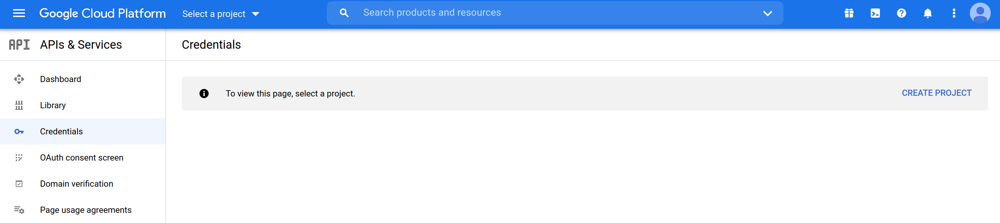
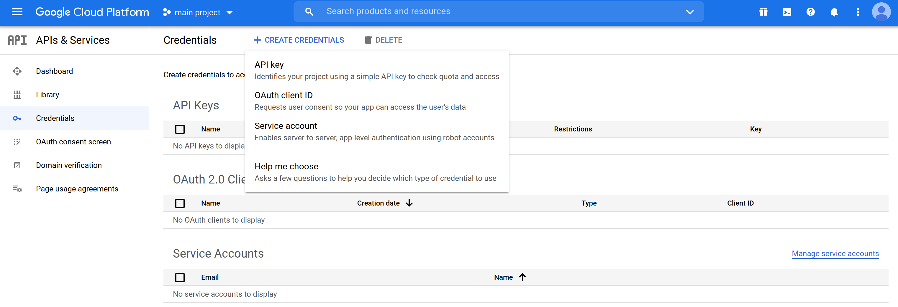
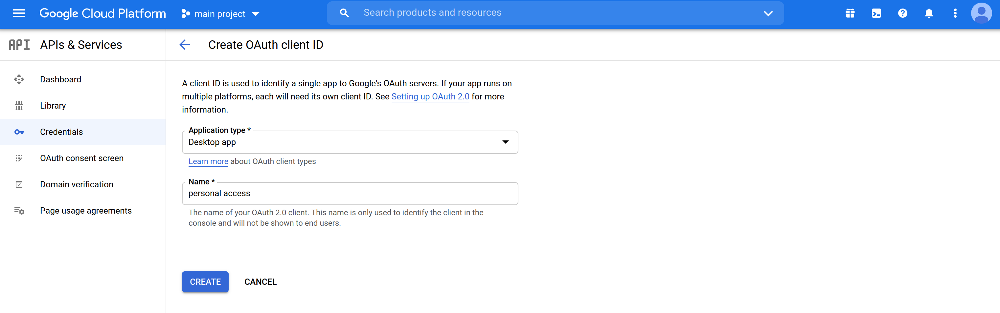
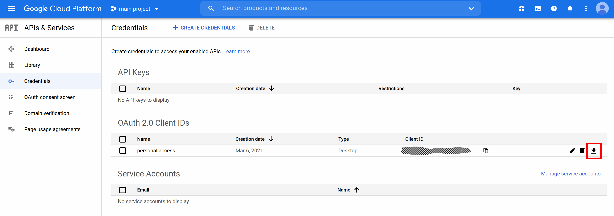
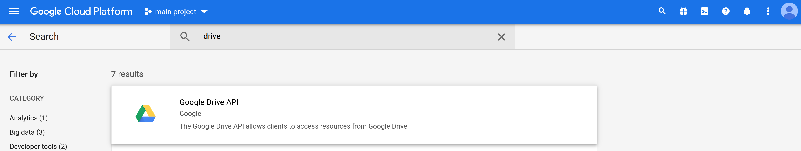

## Enable OAuth 2.0 in your google develoer account

Go to the credentials page on the google developer API console at https://console.developers.google.com/apis/credentials.

- Create a project if you don't have one.

- Set up the OAuth consent screen by clicking on `CONFIGURE CONSENT SCREEN`. For personal use of the API just select *Internal*, provide an app name, an email adress and you're all set.

- Go back to the credentials page under the project you just created and click on `+ CREATE CREDENTIALS` and then on `OAuth client ID`.

- On *Application type* select `Desktop app`, give it a name and then `CREATE`. Just click OK on the pop-up that shows up.

- Back to the credentials page you should have a new register under *OAuth 2.0 Client IDs*. CLick on the download button to get your `client_secrets.json` file (save it somewhere safe).

- Finally, click on `Library` in the *APIs & Services* menu, then search for "drive", select `Google Drive API` and enable it.

- Now go back to the [README](../README.md) to finish setting up.

